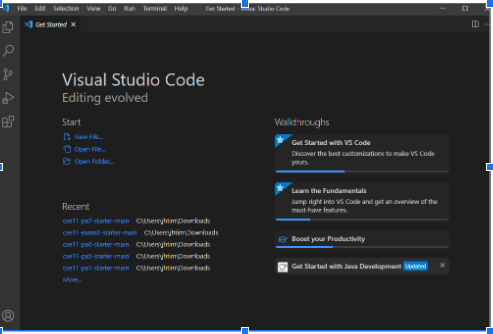
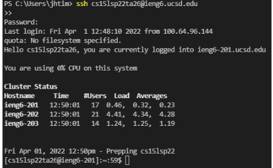
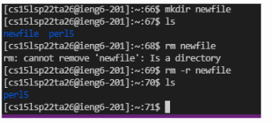
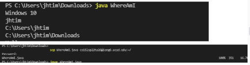
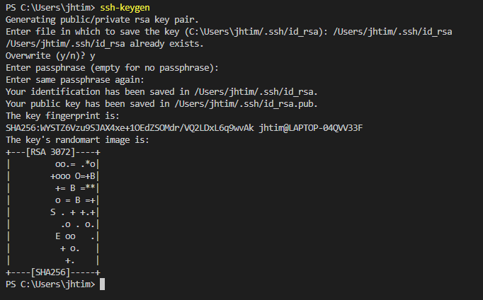
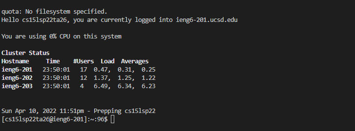

# Blog
**How to Remote Access**

1. Installing VSCode

*To install VScode it is necessary to go to the site by googling or finding a link. After locating the site a user needs to find the right downloader for the computer system. This is typically MacOS or Windows.*
2. Remotely Connecting

*Remotely connecting to the ieng server requires a class specific log-in and a unique password. Both of these can be acquired using the global UCSD site or through given links. Once obtained the command to access the server can be inputted into a any terminal on the client/user side. The command for 15L would be: ssh cs15l(quarter&year)(specific login)@ieng6.ucsd.edu*
3. Trying Some Commands

*Once in logged in it is possible to access files using commands such as, cd or nano. Seeing all the files in a given directory can be done using, ls. And in the case of removing files the rm command can be used*
4. Moving Files with ````scp````

*if files need to be transferred from the client to the server the scp command can be used. This command allows for secure transport of a client file into a specific directory on the server.*
5. Setting an SSH key

*the ssh-keygen command creates a specific security key at a specified location. This allows for easy transfer between a client side and server based on the public and private keys*
6. Optimizing Remote Running

*By scp transferring the public key to the server a connection is formed. This connection between the public and private key enables for files to be transferred without the need for entering the server access password each time*
